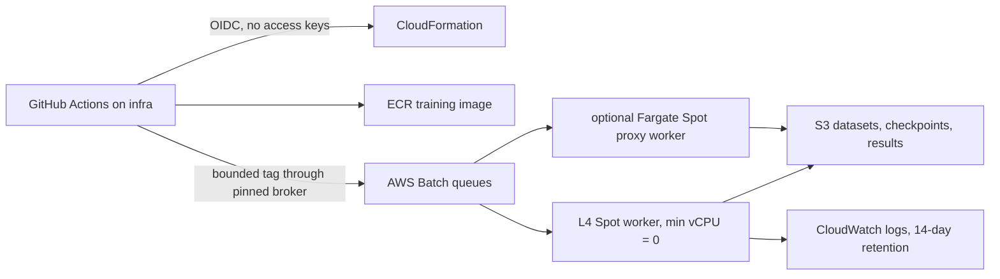

# AWS experiment infrastructure

This directory provides a teammate-accessible, zero-idle AWS path for the
UMaze reproduction and the lower-cost screening funnel. The default GPU worker
is one L4 (`g6.2xlarge`) on EC2 Spot through AWS Batch. Inputs, checkpoints,
logs, and results live in a versioned S3 bucket; images live in ECR. Paid work
starts only from `train-smoke-*`, a validated `train-run-*` request, or a
validated one-run `train-chunk-*` request.



The CloudFormation template is intentionally fixed to `us-east-2`. It creates
public subnets with no inbound security-group rules and no NAT gateway, an S3
gateway endpoint, one zero-idle GPU Spot compute environment, an optional
zero-idle CPU Fargate Spot environment, ECR, S3, CloudWatch Logs, and narrowly
scoped IAM roles. See [the AWS component guide](aws/README.md) and
[the manifest contract](experiments/README.md) for implementation details.

## Cost and account guardrails

The account should have a monthly **$20 net-unblended AWS Budget** with actual
alerts at 50%, 80%, and 100% and a forecast alert at 100%, delivered to the
project owner. AWS Budgets is delayed and is **an alert, not a hard cap**: a
job can continue running and incur charges after an alert fires. The controls
that actually bound this project are:

- Batch compute has `MinvCpus: 0`, a maximum of one `g6.2xlarge` (8 vCPUs),
  Spot only, a 40% On-Demand bid ceiling, and no On-Demand fallback.
- Every manifest declares per-run hourly, wall-time, and dollar envelopes.
- The broker sums those envelopes, accounts for both host-failure attempts,
  and refuses plans above the immutable ceiling for the selected tag preset.
- The submit workflow fetches the current worst-AZ `g6.2xlarge` Spot rate and
  fails closed if AWS returns no price or the rate exceeds `$0.40/hour`.
- A conditional-write S3 lease serializes every aggregate admission decision.
  The durable ledger admits only when Budget actual spend plus all outstanding
  worst-case reservations plus the new retry-inclusive request is at most $15.
  The remaining $5 of the $20 Budget is an explicit reserve for delayed billing
  data and small non-Batch charges. Terminal reservations remain outstanding for
  seven days before that capacity can be reused.
  Admitted jobs may wait together in AWS Batch; the one-worker ceiling makes
  their execution sequential without dropping tag requests.
- A pushed training tag maps to one predefined manifest, profile, hourly-price
  ceiling, and total two-attempt envelope. The workflow has no tag-controlled
  shell input. Among built-ins, only the $0.80 smoke can auto-submit; larger
  families are plan-only. Strict declarative custom requests may submit only
  when their full two-attempt array is at most $5.
- The optional action on the existing `ts-net-out-of-pocket-20` Budget attaches
  a deny policy at 100% actual spend, blocking new normal Batch submissions and
  GitHub deployments. It still cannot stop a running job or remove billing-data
  delay.
- S3 scratch data expires after seven days, logs after 14 days, and unused ECR
  layers are pruned.

Always inspect the Billing console as well as Batch. AWS documents both
[Budget update latency](https://docs.aws.amazon.com/cost-management/latest/userguide/budgets-best-practices.html)
and [Budget actions](https://docs.aws.amazon.com/cost-management/latest/userguide/budgets-controls.html);
neither makes a billing Budget an instantaneous account-wide cutoff.

Keep this as a **standalone AWS account** until the new-account credits are
used. Do not create or join AWS Organizations just to onboard teammates: AWS
states that doing so ends the post-July-2025 Free Plan and expires its credits.
The five additional onboarding activities are Budget, EC2, Lambda, RDS, and a
Bedrock playground prompt. After each $20 activity credit appears, remove the
temporary EC2/Lambda/RDS resource; those are not part of this stack. Track the
credits on the Billing **Credits** page before cleanup. See the
[AWS Free Plan documentation](https://docs.aws.amazon.com/awsaccountbilling/latest/aboutv2/free-tier-plans.html)
for the current account rules.

## One-time owner bootstrap

Do the bootstrap from the signed-in AWS CloudShell session—never create or put
root or IAM access keys in GitHub. The first deployment has to be manual
because it creates the OIDC role that later deployments assume.

```bash
export AWS_REGION=us-east-2
./infra/aws/validate.sh
ENABLE_BUDGET_ACTION=true \
BUDGET_EMAIL='owner@example.edu' \
SKIP_IMAGE=true \
./infra/aws/deploy.sh
```

Read the stack outputs:

```bash
aws cloudformation describe-stacks \
  --region us-east-2 \
  --stack-name temporal-straightening-infra \
  --query 'Stacks[0].Outputs[].[OutputKey,OutputValue]' \
  --output table
```

Add these GitHub Actions variables:

| Variable | Scope | Source |
| --- | --- | --- |
| `AWS_GITHUB_ROLE_ARN` | Repository | `GitHubActionsRoleArn` stack output |
| `AWS_CFN_EXECUTION_ROLE_ARN` | Repository | `CloudFormationExecutionRoleArn` output |
| `AWS_GITHUB_SUBMIT_ROLE_ARN` | Repository | `GitHubSubmitRoleArn` output |
| `AWS_BUDGET_ALERT_EMAIL` | Repository | Existing Budget alert recipient |

Add `AWS_GITHUB_SUBMIT_ROLE_ARN` as a **repository variable**, using the
`GitHubSubmitRoleArn` stack output. Do not put it in a secret and do not issue
an IAM access key. There is no protected GitHub environment or reviewer gate.
Both paid tag runs and read-only manual plans ignore repository input
URI/hash variables. The broker reads canonical URIs from stack outputs and
requires `sha256` metadata plus a version ID on each S3 object. The deployment
role may read only those two canonical input objects for this metadata check.

The deployment role is restricted to the owner, the repository's `infra`
branch, and the exact deploy workflow; ordinary contributors cannot deploy or
push images. The submit role cannot deploy infrastructure; its OIDC
trust accepts only calls through
`.github/workflows/aws-paid-broker.yml@refs/heads/infra` from the predefined
and declarative training-tag namespaces below. Manual and tag broker runs use
only the pinned broker role. A tag's tiny wrapper cannot choose
credentials, configuration, or cost: the reusable broker loaded from `infra`
does that, and requires the tag to target the current `infra` tip exactly.
Contributors need GitHub push permission, not AWS credentials and not email-
based AWS onboarding. GitHub only exposes a new `workflow_dispatch` workflow
after it exists on the default branch, so use the CloudShell scripts during
bootstrap and retain/select `infra` when dispatching after the workflow is
merged.

**Repository-writer trust boundary:** the reusable broker is branch-pinned,
not commit-pinned. Anyone allowed to change and push the `infra` branch is
therefore deliberately inside the AWS billing trust boundary and could change
the broker rules in a later commit. The tag interface is closed and
cost-bounded for normal use, but IAM cannot prove that mutable workflow code
will keep enforcing the ledger. Treat changes to `.github/workflows/`,
`infra/aws/`, and `infra/experiments/` as billing-sensitive infrastructure
changes. Moving that boundary to a smaller maintainer set would require an
immutable broker SHA or protected control-plane paths.

## Request a predefined run with a Git tag

A contributor can queue work by creating a lowercase, auditable CI tag on a
commit already pushed to `infra`. The suffix is only a human-readable run name;
it never enters a shell command or selects arbitrary configuration. Renaming a
GitHub Actions run is not a trigger; the pushed Git tag is the authorization.

```bash
git switch infra
git pull --ff-only origin infra
git tag train-smoke-utsav-ci1
git push origin train-smoke-utsav-ci1
```

The built-in mappings are static: only smoke submits. A custom request submits
only after the separate closed-schema and $5 aggregate checks:

| Tag prefix | Manifest and profile | Two-attempt ceiling | Action today |
| --- | --- | ---: | --- |
| `train-smoke-*` | `smoke.yaml`, `default` | $0.80 | Submit once |
| `train-anchor-*` | `umaze_exact_anchor.yaml`, `minimal` | $115.20 | Plan only |
| `train-screen-*` | `screening_funnel.yaml`, `default` | $86.40 | Plan only |
| `train-finalists-*` | `finalists.yaml`, `default` | $86.40 | Plan only |
| `train-scale-*` | `scaling_trend.yaml`, `default` | $86.40 | Plan only |
| `train-chunk-<family>-<variant>-s<index>-r<rollouts>-<nonce>` | One allowlisted built-in run | ≤ $5.00 | Submit once per plan/source |
| `train-run-<slug>-<nonce>` | Strict `custom/<slug>.yaml` request | ≤ $5.00 | Submit once |

The larger figures are worst-case declared envelopes across every array member
and both infrastructure attempts, not expected spend. They are intentionally
fixed in the broker and cannot be raised by changing a tag suffix. The smoke
path recomputes the deterministic plan, rejects a live L4 Spot rate above
`$0.40/hour`, and gives the worker that static ceiling for conservative runtime
calculation. A
conditional S3 reservation plus a deterministic Batch job name permits only
one smoke submission for a given manifest and source commit. Artifacts are
isolated under that commit so another revision cannot be restored
accidentally.

Pushing `train-smoke-*` is the approval to spend up to its $0.80 declared
two-attempt envelope; there is no second click. The other prefixes publish a
plan artifact but cannot submit. Deleting a tag does not cancel queued or
running Batch work—use the stop procedure below. Manual `workflow_dispatch`
from `infra` remains a free smoke-plan operation.

For a custom run, first add and review a declarative YAML request under
`infra/experiments/manifests/custom/`. It cannot contain a command, image,
Hydra override, AWS resource, input URI, retry count, or arbitrary environment
variable. The filename stem is the tag slug; underscores are allowed in the
slug, while the final component is only an audit nonce:

```bash
python -m infra.experiments.custom_manifest validate \
  infra/experiments/manifests/custom/normacc_probe.yaml
git tag train-run-normacc_probe-utsav01
git push origin train-run-normacc_probe-utsav01
```

The broker compiles that data through a closed allowlist before AWS
authentication, then plans it again against the canonical versioned inputs.
It submits only if the whole array including both fixed attempts is at most
$5. The stack still permits one L4 worker total, so array members queue rather
than adding GPUs. Independent tag workflows use a conditional S3 admission
lease and can add budgeted jobs to the Batch backlog; `MaxvCpus: 8` lets only
one run at a time.

The nonce in custom, smoke, and chunk tags is audit text only. Reservation
identity is the manifest/profile, trusted source revision, and deterministic
plan digest, so a second nonce for the same plan and source is idempotently
deduplicated. A genuine rerun requires a reviewed source or request change.

## Request the Spot GPU quota

New accounts commonly start with a zero **All G and VT Spot Instance
Requests** quota. Request 8 vCPUs in `us-east-2`—exactly one `g6.2xlarge`—and
do not submit a GPU job until it is approved:

```bash
QUOTA_CODE="$(aws service-quotas list-service-quotas \
  --region us-east-2 --service-code ec2 \
  --query "Quotas[?QuotaName=='All G and VT Spot Instance Requests'].QuotaCode | [0]" \
  --output text)"
aws service-quotas request-service-quota-increase \
  --region us-east-2 --service-code ec2 \
  --quota-code "${QUOTA_CODE}" --desired-value 8
```

Record the request ID and wait for `CASE_CLOSED`/approved status. The AWS
[Service Quotas guide](https://docs.aws.amazon.com/servicequotas/latest/userguide/request-quota-increase.html)
explains how to inspect requests.

## Upload immutable inputs

Use the write-once helper from an owner/admin AWS session. It computes both
digests, stores them as metadata on the two canonical versioned objects,
verifies the round trip, and refuses to overwrite either key:

```bash
./infra/aws/upload_inputs.sh point_maze_umaze.zip umaze_fixed_v1.pkl
```

These exact keys are stack outputs and IAM allow-list entries. Paid CI fails
closed if either versioned object lacks 64-hex `sha256` metadata. The goal file
contains the normal `plan.py` fields plus a non-empty
`proxy_trajectories` list. Each proxy item needs observations, one
`goal_observation`, and either aligned `shortest_path_steps` or `states` plus
`goal_state` so the runner can compute A*. The archived `plan_targets.pkl`
files do not contain this extension and cannot be uploaded unchanged. Workers
checksum both inputs before using them, keep separate data/training/planner
seeds, and upload their metadata with the result.

## Cheapest safe rollout

Follow this order. Do not jump from stack creation to the paper anchor.

1. Push `infra`; the validation workflow runs Python tests, all manifest
   checks, shell syntax checks, and `cfn-lint` without touching AWS.
2. Bootstrap/deploy the stack with no image build. All compute remains at zero.
3. Run **Deploy AWS infrastructure** manually with `build_image=true`. This
   pushes the image but submits no job.
4. From the owner CloudShell session, submit the default CPU smoke command and confirm
   that its log and S3 status artifact arrive. This catches IAM/container/S3
   mistakes without a GPU.
5. Run **Request an AWS experiment** manually from `infra` to produce the free
   smoke plan. Review `plan.json`, then push a `train-smoke-*` tag on that same
   current `infra` tip. The broker rechecks the live Spot rate immediately
   before its one allowed submission. This is one 10-rollout, one-epoch L4 job
   that exercises training, proxy analysis, and a two-goal/two-optimizer-step
   planner pass.
6. Check the Batch exit code, CloudWatch log, S3 checkpoint/result upload, and
   estimated cost before approving any larger plan.

To launch the CPU infrastructure smoke with one attempt and a ten-minute hard
timeout:

```bash
python3 infra/aws/submit_job.py \
  submit --compute cpu --job-name ts-cpu-infra-smoke \
  --max-runtime-seconds 600 --attempts 1
```

Spot interruption is normal. The worker uploads logs/checkpoints on `SIGTERM`,
and Batch retries host failures only. Never make a run correct only when a
single uninterrupted worker survives. AWS's
[Batch Spot guidance](https://docs.aws.amazon.com/batch/latest/userguide/bestpractice6.html)
describes this operating model.

## Experiment order

Use a **minimal released-dataset paper-recipe anchor plus a screening funnel**,
not the funnel as a replacement for reproduction. This is the strongest anchor
available from the single released UMaze dataset, but it is not an exact
reproduction of Table 1's three independently sampled datasets:

1. `umaze_exact_anchor.yaml --profile minimal`: projector-only versus the
   paper's projector+curvature method over three matched **training** seeds
   (**six runs**) on one canonical released dataset.
   Add the patch-token baseline only if the six-run anchor is sound, producing
   the full nine-run profile. This uses the v1 planner learning rate `0.01`.
2. `screening_funnel.yaml`: candidate variants at 100 rollouts, epoch 10, three
   seeds. Rank by the candidate proxy; do not call it validated until its
   prospective relationship with planner success is measured.
3. `finalists.yaml`: projector-only, paper curvature, and the selected method
   with identical data seeds, goal files, and planner seeds. Bootstrap by both
   training seed and goal; goal pairing alone misses training variance.
4. `scaling_trend.yaml`: best candidate versus baseline at 50, 200, and 800
   trajectories. Treat the six runs as a trend diagnostic, not proof of a real
   discrepancy; the paper-scale Medium setting uses 4,000 trajectories.

The proxy is Spearman correlation between latent distance-to-goal and true A*/
shortest-path distance, aggregated per held-out trajectory/goal. It is not
remaining time on random training trajectories and it is not “zero compute”:
existing checkpoints must be re-encoded. Current training also updates the
predictor, decoder, projector/aggregator, and action/proprio encoders—not only
an 8-channel head.

The planner/manifest details and local dry-run commands are in
[experiments/README.md](experiments/README.md). Manual dispatch and all
non-smoke tag mappings are plan-only. The six-run anchor's declared
one-attempt envelope is
currently $90; because Batch permits a second attempt only for host/agent
failures, the Actions guard treats $180 as the absolute submission ceiling.
The default `$2`/a proposed `$20` preflight intentionally refuses that anchor;
review smoke evidence before implementing a cost-safe chunked anchor trigger.
That ceiling is separate from the monthly net-after-credits AWS Budget.

## Monitor and stop

List active jobs and inspect one job:

```bash
aws batch list-jobs --region us-east-2 \
  --job-queue temporal-straightening-gpu --job-status RUNNING
aws batch describe-jobs --region us-east-2 --jobs JOB_ID
```

Stop one job immediately (use `cancel-job` instead for a job that has not
started):

```bash
aws batch terminate-job --region us-east-2 \
  --job-id JOB_ID --reason "manual cost stop"
```

Emergency stop-all: disable both queues first, terminate every active job in
the Batch console, then disable the compute environments. Disabling alone does
not terminate an already running worker.

```bash
aws batch update-job-queue --region us-east-2 \
  --job-queue temporal-straightening-gpu --state DISABLED
aws batch update-job-queue --region us-east-2 \
  --job-queue temporal-straightening-cpu --state DISABLED
aws batch update-compute-environment --region us-east-2 \
  --compute-environment temporal-straightening-gpu-spot --state DISABLED
aws batch update-compute-environment --region us-east-2 \
  --compute-environment temporal-straightening-cpu-fargate-spot --state DISABLED
```

Re-enable in the reverse order after the incident is understood. For full
teardown, terminate jobs and delete the CloudFormation stack. The S3 bucket and
ECR repository are deliberately retained, so stack deletion does **not** stop
their small storage charges; export evidence, empty/delete them explicitly
only when the team has agreed the artifacts are no longer needed.
